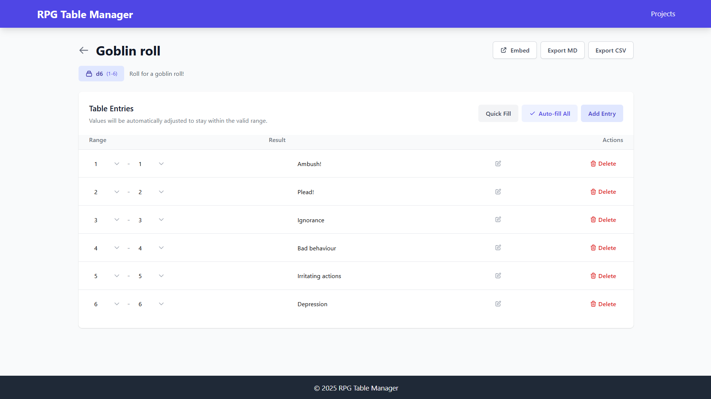

# RPG Table Manager

A web application for managing random tables for tabletop RPG games. Create, edit, and manage your random tables with an easy-to-use interface.

## Features

- Create and manage multiple random tables
- Support for various dice expressions (e.g., d20, 3d6, etc.)
- Auto-fill and quick-fill options for table entries
- Mobile-friendly interface
- Export tables to Markdown or CSV
- Embed tables in other websites

## Screenshots

### Desktop View

*Main project list view showing multiple RPG table collections*

### Project Tables View

*List of tables in a project*

### Table Editor

*Table editor with dice expression and range management*

### Mobile View

*Responsive mobile interface for easy table management*

### Iframe View

*Easily copy and paste the iframe code to embed the table in your website*

## Requirements

- PHP 7.4 or higher
- MySQL/MariaDB
- Composer

## Installation

1. Clone the repository:
```bash
git clone https://github.com/yourusername/rpg-table-manager.git
cd rpg-table-manager
```

2. Install dependencies:
```bash
composer install
```

3. Copy the environment file and configure it:
```bash
cp .env.example .env
```
Edit `.env` with your database credentials and other settings.

4. Set up the database:
   - Create a new MySQL database
   - Import the database schema from [database/schema.sql](database/schema.sql)
   - Configure the database connection in `.env`

5. Set up your web server:
   - Point your web server to the project's public directory
   - Ensure URL rewriting is enabled

## Development

The project uses:
- PHP for backend
- Alpine.js for frontend interactivity
- Tailwind CSS for styling

## License

[MIT License](LICENSE) 